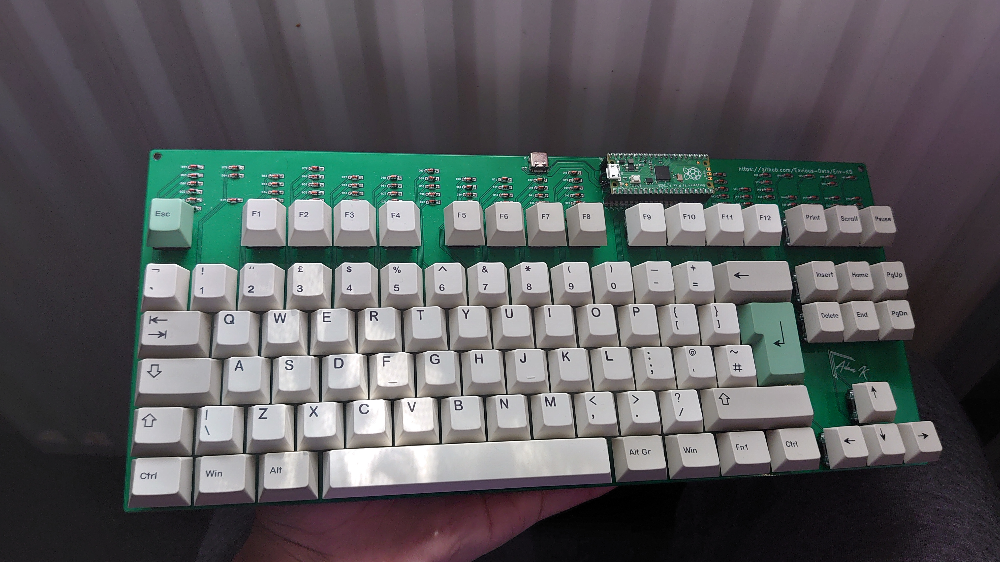

# Env-KB
 A custom mechanical keyboard inspired by the CFTKB Mysterium

[Build Guide and Parts List](_docs/guide-and-parts.pdf)

## Just a small warning
since this project is actively being updated I highly recomend you check the gerbers or kicad files before just throwing this to a PCB fab, there are things I could have missed.

### What is to do?
- [x] ~~For Rev#1 and onward I would like the option of a case, I think a sandwich type design would be best.~~
- [x] ~~I currently dont know how to use CAD software so the above point will either need to be done by someone else or Ill try to figure out some CAD software.~~
- (I made do with KiCad and exported eco layers to DXF)

I would like to keep as much possible open source and compatible outside this keyboard because there is a serious lack of TKL things so for example a TKL plate is something I'd like to be open source and avaliable to others.
That said there is a lack of TKL things in the mechanical keyboard market so Im always happy to try and add more ISO and TKL things.

### Why a RPI Pico?
uh well why not, I think it would be a nice example for people to use as a example since python is surprizingly simple.
Circuitpython + KMK is being used here but if you wish you could write your own firmware, Im personally waiting for QMK to be ported.

I also quite like that this project serves as an example of what can be done with a Raspberry Pi Pico

### ISO only?
No This is ANSI and ISO (The prototype was ISO only though).

### Misc bits!
Feel free to make your own PCBs of this keyboard, if you feel like supporting me you can "Buy me a coffee"
Paypal: envy@envious.media

### Things of handy dandy nature!
This keyboard makes use of KMKfw and CircuitPython
* https://github.com/KMKfw/kmk_firmware
* https://github.com/adafruit/circuitpython

So one note in relation to circuitpython, Im waiting for Circuitpython 7.0.0 which should allow us to change USB information without needing a custom firmware, this should be pretty handy.

## BUILD INSTRUCTIONS
if you arent interested in checking out the PDF here are some quick and dirty build instructions
- included in your kit there will be female headers and male headers for the raspberry pi pico 
- - The female headers are to be installed to the board and the male to the pico
- all diodes face with their top toward the right side of the board

- for USB Type-C you are going to need to connect the TP pads on the underside of your PICO to the matching pads on the board, this can be done with some wire or some pogo pins

- for acrylic cases included in my kits you'll get some M3 screws, nuts and 3mm non threaded spacers.
- The screws are 12mm long
- the spacers are to be placed between the top plate and the PCB as 3mm is needed to properly fit MX style switches
- the M3 nut will be placed under the PCB with the back acrylic next and with another nut to secure the back acrylic to the whole keyboard

you can find pictures on what its suposed to look like here:
https://github.com/Envious-Data/Env-KB/tree/main/_pictures/built