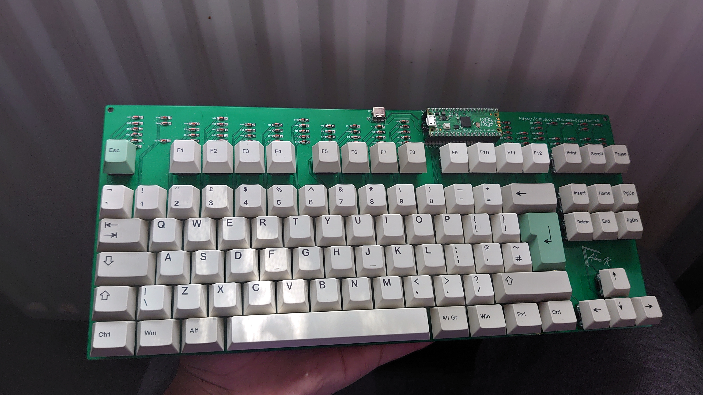

# Env-KB
 A custom mechanical keyboard inspired by the CFTKB Mysterium.
 
- Project Name: EnvKB80
- Nickname: Delirium

[Link to Build Guide](_docs/EnvKB-BuildGuide.pdf)

### About:
This is a raspberry pi pico powered keyboard I designed as I wanted something similar to a CFTKB Mysterium but easier to solder and a bit more robustly designed.

### Why a RPI Pico?
uh well why not, I think it would be a nice example for people to use as a example since python is surprizingly simple.
Circuitpython + KMK is being used here but if you wish you could write your own firmware, Im personally waiting for QMK to be ported.
I also quite like that this project serves as an example of what can be done with a Raspberry Pi Pico

### Extra warning
The Windows 7 lacks drivers for circuitpython so you may need to download a driver pack from adafruit.

### PCBWAY

[PCBWAY](http://pcbway.com) Kindly sponsored a batch of PCBs of which you can see [pictures](_pictures/Hotswap/) of inside the pictures folder.
