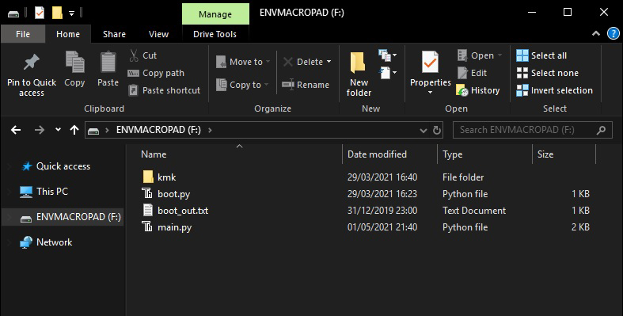

### What is this?

Firmwares! here is provided python code for Circuitpython and a QMK firmware file, you can pick either Circuitpython+KMK which allows for some code editing and various tweaks or QMK which as of writing this doesnt have functional via support but is great for flash 

## KMK Setup instructions
The setup for any of my keyboards using a Raspberry Pi Pico should generally be the same

- Install [Circuitpython](https://circuitpython.org/board/raspberry_pi_pico/) To your Raspberry Pi Pico.
- Once installed, Extract A KMK Firmware zip to your raspberry pi pico
(Unless you have an original prototype board you will want Revision 1 or newer)

- there is a screenshot above on what the files on your Raspberry Pi Pico should look like

## QMK Setup instructions
Alternatively if you dont want to use KMK you can flash this QMK firmware built from this port
https://github.com/sekigon-gonnoc/qmk_firmware/tree/rp2040/keyboards/rp2040_example

- Plug the raspberry pi pico in while holding the bootsel button.
- A drive will show up on your computer called "RPI-RP2", this is the pico's bootloader.
- copy and paste into the QMK UF2 file into the pico's bootloader.
- done.

## POSSIBLE ISSUES
Circuitpython may have some driver issues with windows 7 so keep that in mind if thonny doesnt work and you are trying to debug.
https://learn.adafruit.com/circuit-playground-express-circuitpython-5-minute-guide/connect

### Misc
If you've designed your own keyboard and it happens to be similar in its schematic you can use my keymap (as an example), I couldnt find a iso or ansi TKL keymap for KMK so there is mine if needed. The keymap also contains a basic example for an aditional layer, the menu/option key has been replaced with a layer 1 modifier.